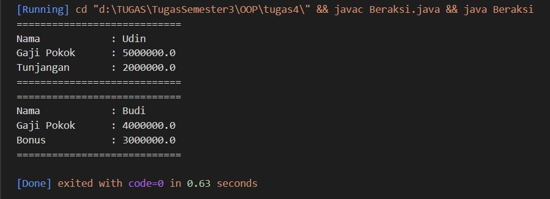

# LAPORAN PRAKTIKUM3
## LATIHAN CLASS DENGAN SETTER DAN GETTER

### Implementasikan java code diagram class berikut :

1. Pertama kita buat class pegawai, class pegawai ini merupakan class yang mewarisi atau bisa disebut superclass. Pada atribut nama dan gajipokok kita buat akses private dan untuk setter dan getter buat akses public. Berikut porgramnnya :

2. Selanjutnya buat class bernama Manager, class ini disebut subclass atau class yang diwarisi oleh superclass. Untuk atribut tunjangan memiliki akses private dan setter getter beraksesibilitas public. Ketika membuat subclass kita harus ketikan perintah super.cetakinfo(); ini berfungsi agar subclass saling tekoneksi. Berikut Programnya :

3. Berikutnya buat class bernama Programer, class ini disebut subclass atau class yang diwarisi oleh superclass sama seperti class Manager. Untuk atribut tunjangan memiliki akses private dan setter getter beraksesibilitas public. Ketika membuat subclass kita harus ketikan perintah super.cetakinfo(); ini berfungsi agar subclass saling tekoneksi. Berikut Programnya :

4. Yang terkhir merupakan file index atau file inti. pada bagian ini kita buat objek dan atributnya tiidak lupa juga beri nilai pada bagian atribut. Berikut programnya :

5. Ini merupakan Hasil dari program yang telah kita buat.

